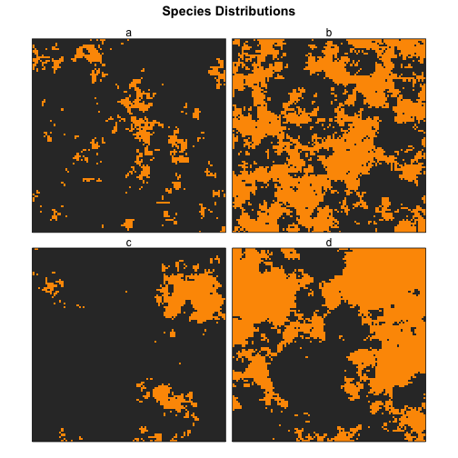
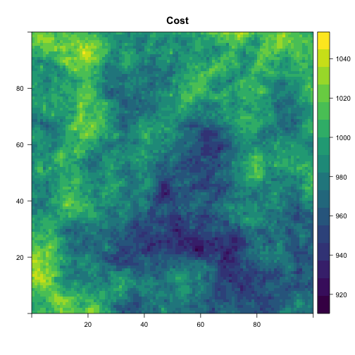
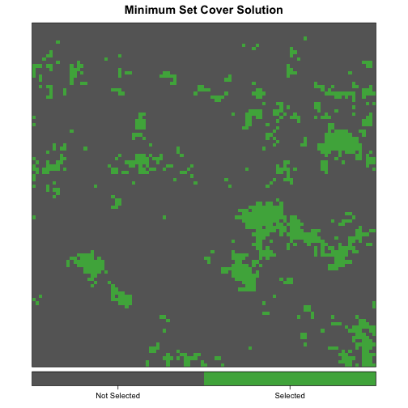
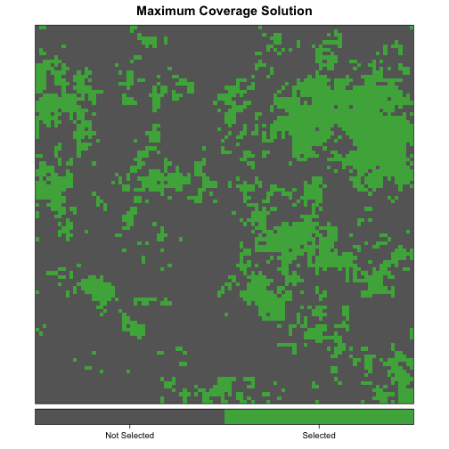

[](https://travis-ci.org/mstrimas/prioritizr)
[](https://ci.appveyor.com/project/mstrimas/prioritizr)
[](https://codecov.io/github/mstrimas/prioritizr?branch=master)
[](https://CRAN.R-project.org/package=prioritizr)

<!-- README.md is generated from README.Rmd. Please edit that file -->
Conservation Prioritization with Integer Programming in R
=========================================================

`prioritizr` is an R package for solving systematic conservation prioritization problems using the techniques of integer linear programming (ILP). In particular, both the minimum set cover (Marxan-like) and maximum coverage reserve design problems can be solved. The package offers a unified interface to a variety of commercial and open-source ILP solvers. In contrast to heuristic methods, such as simulated annealing, the ILP methods used by `prioritizr` can find exact solutions to optimization problems.

This package consists largely of two layers of functions: those that define a reserve design problem and those that solve a reserve design problem using any one of a variety of solvers. The details of the solvers are intentionally abstracted away so that the user requires minimal knowledge of the specific solvers or ILP in general.

The currently supported solvers are as follows. Each must be installed separately from this package to be accessible.

-   [Gurobi](http://gurobi.com) is a state-of-the-art commercial optimization software with an R package interface. It is by far the fastest of the solvers available in this package, however, it is also the only one that isn't free. That said, free academic licenses are available.
-   [SYMPHONY](https://projects.coin-or.org/SYMPHONY) is an open-source integer programming solver that is part of the Computational Infrastructure for Operations Research (COIN-OR) project, an initiative to promote development of open-source tools for operations research (a field that includes linear programming). Two R packages exist to provide interfaces to SYMPHONY: `Rsymphony` (on CRAN) and `lpsymphony` (on Bioconductor). On Windows and Mac, may be easier to install.
-   The GNU Linear Programming Kit ([GLPK](https://www.gnu.org/software/glpk/)) is an open-source package for solving linear and integer linear programs. The R package glpkAPI provides an interface to the low-level GLPK API.

Installation
============

``` r
if (packageVersion("devtools") < 1.6) {
  install.packages("devtools")
}
devtools::install_github("mstrimas/prioritizr")
```

Example usage
=============

For full details on this package, consult the vignette with `browseVignettes("prioritizr")`. What follows are some simple example of how this package can be used to solve conservation prioritization problems.

Required Packages
-----------------

``` r
library(prioritizr)
# for plotting
library(rasterVis)
library(viridis)
```

Data generation
---------------

The function `gaussian_field()` can be used to generate spatially auto-correlated random fields, to be used as semi-realistic spatial variables. All conservation prioritization problems involve balancing a trade-off between representing features of conservation interest and minimizing the cost of protection. Therefore we start by generating distributions for four species and a cost layer, all on a 100x100 raster grid of planning units.

``` r
set.seed(1)
# raster 100x100 template
e <- raster::extent(0, 100, 0, 100)
r <- raster::raster(e, nrows = 100, ncols = 100, vals = 1)
# generate 9 feature distributions with different scales and range sizes
species <- mapply(function(x, y, r) gaussian_field(r = r, range = x, prop = y),
            rep(c(5, 25), each = 2),
            rep(c(0.1, 0.5), times = 2),
            MoreArgs = list(r = r))
species <- raster::stack(species)
species <- setNames(species, letters[1:raster::nlayers(species)])
levelplot(species, main = 'Species Distributions', layout = c(2, 2),
          scales = list(draw = FALSE),
          col.regions = c("grey20", "#fd9900"), colorkey = FALSE)
```



``` r
# genrate cost layer
cost <- gaussian_field(r, 20, mean = 1000, variance = 500)
cost <- setNames(cost, "cost")
levelplot(cost, main = "Cost", margin = FALSE, col.regions = viridis)
```



Minimum set cover problem
-------------------------

In the context of systematic reserve design, the minimum set cover problem seeks to find the set of planning units that minimizes the overall cost of a reserve network, while meeting a set of representation targets for the conservation features. The cost is often either the area of the planning units or the opportunity cost of foregone commercial activities (e.g. logging or agriculture). The representation targets ensure that each species is adequately represented in the reserve network.

This problem is equivalent to a simplified Marxan reserve design problem, with the Boundary Length Modifier (BLM) set to zero. To specify a prioritization model of this type we use the `minsetcover_model()` function to create a `minsetcover_model` S3 object. This function takes data in a variety of formats (raster, vector, or tabular) and generates a standard object encapsulating the prioritization problem. Here we set targets for all species to protect 20% of their existing range.

``` r
msc_model <- minsetcover_model(x = cost, features = species, targets = 0.2)
class(msc_model)
#> [1] "minsetcover_model" "prioritizr_model"
```

Maximum coverage problem
------------------------

The maximum coverage problem seeks to find the set of planning units that maximizes the overall level of representation across a suite of conservation features, while keeping cost within a fixed budget. The cost is often either the area of the planning units or the opportunity cost of foregone commercial activities (e.g. from logging or agriculture). Representation level is typically given by the occupancy within each planning unit, however, some measure of abundance or probability of occurrence may also be used.

This problem is roughly the opposite of what the conservation planning software Marxan does. To specify a prioritization model of this type we use the `maxcover_model()` function to create a `maxcover_model` S3 object. This function takes data in a variety of formats (raster, vector, or tabular) and generates a standard object encapsulating the prioritization problem. Here we set the budget to 25% of the total cost of the study area.

``` r
b_25 <- 0.25 * raster::cellStats(cost, "sum")
mc_model <- maxcover_model(x = cost, features = species, budget = b_25)
class(mc_model)
#> [1] "maxcover_model"   "prioritizr_model"
```

Solving prioritization problems
-------------------------------

The function `prioritize()` offers a unified interface to solving either type of prioritization problem using any of the available solvers. To solve the minimum set cover problem to within 0.1% of optimality use:

``` r
msc_results <- prioritize(msc_model, gap = 0.001)
```

By default, this function uses the best available solver, which is Gurobi if it is installed. Alternatively, the solver can be specified explicitly. For example, we solve the maximum coverage problem with SYMPHONY:

``` r
mc_results <- prioritize(mc_model, solver = "symphony", gap = 0.001)
```

The resulting solution can be displayed with `plot_selection()`:

``` r
plot_selection(cost, msc_results$x, title = "Minimum Set Cover Solution")
```



``` r
plot_selection(cost, mc_results$x, title = "Maximum Cover Solution")
```



The objective function values for these solutions can be access with:

``` r
# minimum set cover objective
msc_results$objval
#> [1] 985393.9
# maximum cover objective
mc_results$objval
#> [1] 5667
```

For full details on the functionality of this package, consult the vignette:

``` r
browseVignettes("prioritizr")
```
